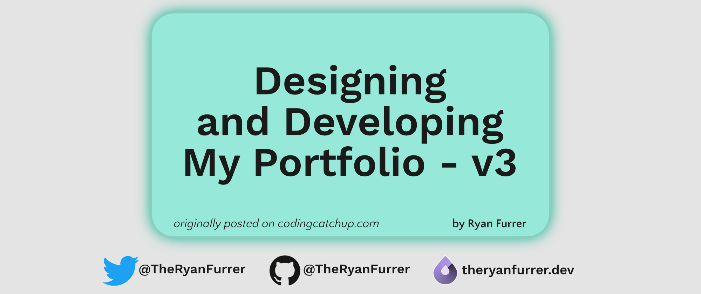
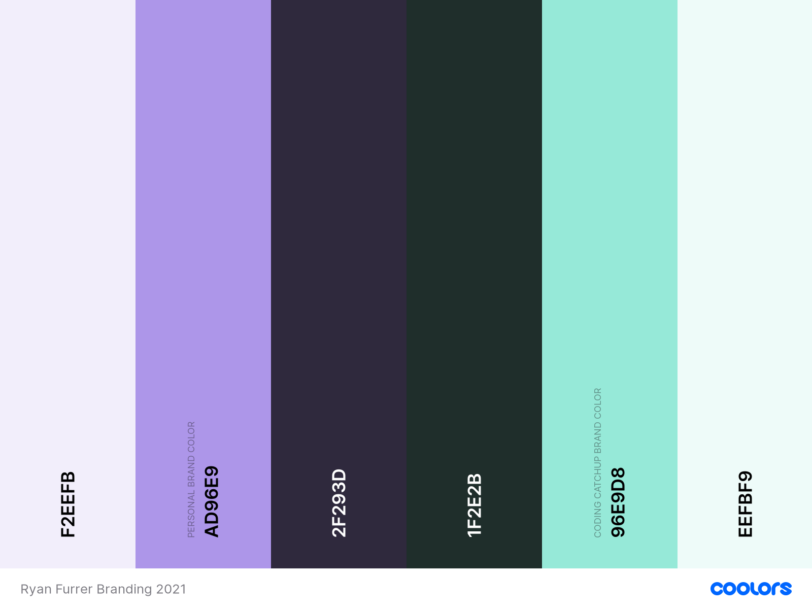

## The Why

I had previously built a decent portfolio, but with the "re-branding," which I recently, made, along with my re-focus on learning code, I thought it wise to create a new home on the Internet. Something I was proud of to house my work while learning more and prepare to apply for my first web development job.

I already want to make changes to my site, but I *have to concentrate* elsewhere if I want to actually get a job in this area. Further refinements can be made in the future, but I can't let myself be distracted. In the end, it is useless to have a *nice* portfolio, but nothing to fill it with.

I say this because I don't think I'll ever feel 100% complete with my portfolio, but I can get it to the point where I'm content to share it with the world - so I've done exactly that.

## Portfolio Versions

### v1 - Published February 2019

This was built about a month after I started learning HTML and CSS. It's nothing special, but it was the first web page I had built in full. None of the projects were ever completed, but this was the first thing I was excited to code. (link no longer available)

### [v2](https://ryan-furrer-v2.netlify.app/) - Published in August 2019

v2 was built about 6 months after the "completion" of v1. I learned a lot in this time, which, I believe, can be observed in the design language. Looking at it now, I see many things that need refinement, but I remember being pleased with the way this one came together at the time.

### [v3](https://theryanfurrer.dev) - Brand new!

v3 was recently completed and announced to the world on 7/2/21, which is *quite some* time since August 2019. A lot has happened over the years, and I will not make excuses for my insufficient progress... I was simply not disciplined enough to do the work that needs to be done to change careers as I want. 

## The Tech Stack

* HTML
  As with everything I build from scratch, I like to focus on using semantic HTML, as it helps greatly with accessibility and organization. If you're not using semantic HTML in your projects, you're not helping anyone.
* CSS (SCSS)
  I *love* using SCSS, and it's definitely my preferred method for writing CSS these days. If you're not familiar with SCSS, it "...is a stylesheet language that’s compiled to CSS. It allows you to use variables, nested rules, mixins, functions, and more, all with a fully CSS-compatible syntax."

That said, if you are new to front-end work, please do your due diligence and learn regular CSS before anything else in the CSS world. It is powerful and is a prerequisite, in my opinion, for any CSS frameworks, stylesheet languages like SASS, etc.

* JavaScript (future endeavors)
  While I am still learning JavaScript, I have a few ideas on how to implement it in my site. A theme-switcher is #1, but also some fun easter eggs!
* Deployed on Netlify 
  I *love* [Netlify](https://www.netlify.com/) for so many reasons, but the #1 reason is how simple and quick it is to get a new project deployed onto the web. There are other options, like [Vercel](https://vercel.com/), but for now I am loyal to Netlify.

## The Design

When designing my portfolio, I knew that I wanted something clean, but not necessarily minimal. I love minimalist designs, but I didn't want that to limit my portfolio. I also knew I wanted to refine the card design I used on [Coding Catchup v2](https://coding-catchup-v2.netlify.app/). 

<iframe src="https://www.loom.com/embed/7c830247c89c401f81dd67754f01f285" frameborder="0" webkitallowfullscreen mozallowfullscreen allowfullscreen style="position: absolute; top: 0; left: 0; width: 100%; height: 100%;"></iframe>

Hover effect on v2 of Coding Catchup

So first I thought about what colors I would like to use...

### The Colors

My original goal was to identify a brand color for me and one for my tech blog Coding Catchup. I chose purple for myself as an evolution of the indigo color that I featured in the previous version of my portfolio.

v2 main color: #646FCB
v3 main color: #AD96E9

As for Coding Catchup, I've had my eyes on this sort of green-blue color for a while and decided to run with it. 

v1 main color: #3FC8A7
v3 main color: #96E9D8

Little did I realize these two colors actually work well together, and the Coding Catchup green is now featured on my portfolio site as an accent color. I think of this as a type of harmonious binding in my two main projects - I like it!

### The Content

Content, layout and structure are pretty straightforward. As a single-page app, I simply have to link to different IDs on the page, like Projects, About and Contact Me.

I chose to place my projects first, so it's the first thing (technically second thing) that someone notices when visiting my site. In the Projects section, there are cards containing information about each of my projects. At the time of writing, I am featuring 3 Projects: [Coding Catchup](http://codingcatchup.com), the [Portfolio](http://theryanfurrer.dev) itself, and my [Wedding](http://furrever.wedding) website. 

Next up is the “About” section where visitors can learn more about me - pretty self-explanatory! I’m not good at writing about myself, so this will undergo some revisions for sure. 

Lastly, is the “Contact Me” section. This is simply a contact form connected via Netlify Forms, which again makes it *so simple*. Netlify even has integrated spam protection, which, while I am sure it won't stop every bit, is good enough for me at the moment.

## The Assembly

### Content First

As I worked through this, I had a basic design in mind, so it was easy for me to insert all HTML and style later. Having said that, it hurts me to continue adding content when my navigation bar still looks like a standard list. But I trusted the process, and frankly, it was pretty fast... not that the site is huge lol.

After putting all the content together, it was time to make it look better.

### Styling Second

Again, coming into this with an idea of a design and color scheme helped immensely. Hell, I had already picked out my colors and fonts, so I got to work creating my SCSS variables, linking to Google Fonts for [Poppins](https://fonts.google.com/specimen/Poppins?query=popp) and [Open Sans](https://fonts.google.com/specimen/Open+Sans?query=open+sa), and prettying up my new portfolio. Oh, and I of course created a CSS Reset using [Andy Bell's](https://piccalil.li/) [Modern CSS Reset.](https://github.com/andy-piccalilli/modern-css-reset)

When styling the site, as with most other projects, I started with the mobile site and then built larger from there. For me, I prefer starting small and building out for a few reasons.

1. Mobile traffic is *much* higher than desktop traffic, so I had to make sure everything looked good there first.
2. Mobile layouts are typically clear and straight forward. It's just a column of content, whereas larger screens, including tablets, laptops and desktops, allow you to have a little more fun with your designs and layouts.

From there, I made sure everything was responsive and looked good across as many devices and browsers worth checking. Currently, the site is simple, with only one media query for screen size breakpoints.

### Finishing Touches

The last thing I've done was add what I like to think of as finishing touches - things that merely make for a nicer experience. These are things like the `:hover` styles on links, navigation items, my logo, etc., but also the outline on my projects and the contact form. Just some things to add a sense of polish to the site.

Although I am not 100% satisfied with it, I have to build new projects to be featured on my site! In my opinion, the portfolio should grow with the developer, and so far I think v3 shows I've grown... even a little.

## Extras

After the main site was built, there were just a few things left to do, these included:

* Build a success page users see after submitting a message via the form.

    This was done easily with the Netlify docs on their [form setup](https://docs.netlify.com/forms/setup/). It isn't anything fancy, but at least it matches the rest of the site's styles.
* Create a "Links" page

    Again, a very simple page that I wanted to create to easily have all my links in one place. There are services out there that allow you to do this without code, like [bio.link](http://bio.link), but I wanted it to match the look and feel of the rest of the website, and it's easy enough to do it myself.
* Forward subdomains to respective pages

    Again, it's simple, but something that makes it easier to remember different links and seems a little more professional - in my opinion.

    I have 3 domains currently forwarded:

  * [blog.theryanfurrer.dev](http://blog.theryanfurrer.dev) points to [codingcatchup.com](http://codingcatchup.com)
  * [links.theryanfurrer.dev](http://links.theryanfurrer.dev) points to [theryanfurrer.dev/pages/links.html](http://theryanfurrer.dev/pages/links.html)
  * [timline.theryanfurrer.dev](http://timline.theryanfurrer.dev) points to my [Polywork](https://www.polywork.com/theryanfurrer) profile

## Wrapping up

That's all I've got for now. I hope you enjoyed reading about my process, and I hope you choose to return for more! Feel free to contact me via my website or on Twitter if you have any questions or want to say hello.

There is always more work to be done, but only so many hours in the day! My next project (at the moment) is an e-commerce site built with React. This is new for me, but I am enjoying it so far. Subscribe for more weekly updates, project summaries, and tech articles, and/or follow me on Twitter!