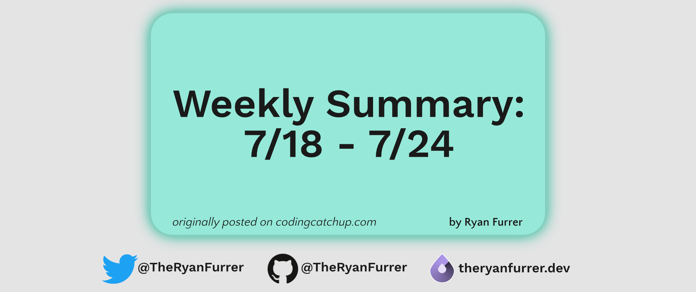
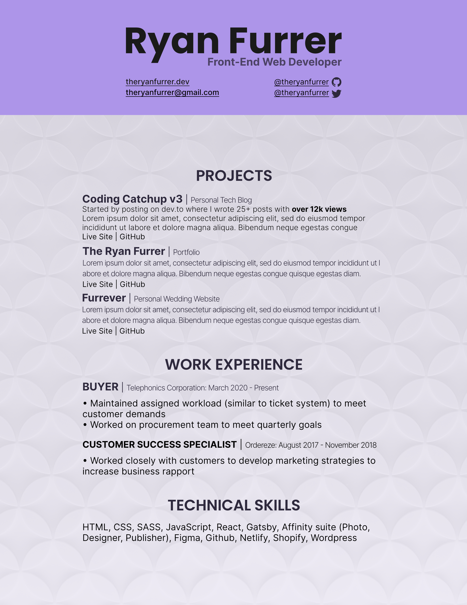

Welcome to the fifth installment in my weekly summary series, where I give quick recaps of what I worked on the previous week to keep myself accountable.

First, let's go over my weekly schedule:

## Current Weekly Schedule

* **Monday - Thursday**: Study from 6:00pm - 8:00pm-ish. Sometimes I go until 9pm depending on how I feel.
* **Friday**: Study from 1:00pm - 4:00pm. I like to give myself more time to study when I can, and working half-days on Fridays for my current job leaves a significant time for extra coding.
* **Saturday**: Study from 7:30am - 9:30am. I give myself at least 2 hours on Saturdays, even though I often get more time in.
* **Sunday**: Day off This is my day to recover, get energized and prepare for the coming week!

All this works with my personal goal of studying / coding 2 hours a day. I would like to do more, but I don't have the mental bandwidth to do more, usually, throughout the week.

I don't always stick to this schedule, but I try my best to do so. Now then, let's get to it!

## Sunday, July 18th

Sunday I published the 2nd issue of the [Coding Catchup Newsletter](https://www.getrevue.co/profile/theryanfurrer/issues/coding-catchup-issue-2-693885) with help from [Revue](https://www.getrevue.co/)! While I am still deciding what format I'd like to use with my newsletter, I believe the 2nd issue was much better than merely republishing my blog posts as an email - I think I can provide more value than that - what do you think?

## Monday, July 19th

Monday was a productive day, which was a nice way to kick off the week! I signed up for [Cloudinary](https://cloudinary.com/) to host the images on my [wedding website](https://furrever.wedding/), so it is easier to serve the most appropriately sized images for anyone visiting the site. This should help site performance and save data for those on mobile phones.

I also added my wedding site as a featured project to my [portfolio](https://theryanfurrer.dev/#projects). I think it's a complete site that shows off what I can do, and I'm proud of it!

I finished up my night by studying React for 40 minutes on [Udemy](https://www.udemy.com/course/react-redux/?utm_source=adwords&utm_medium=udemyads&utm_campaign=React_v.PROF_la.EN_cc.US_ti.7450&utm_content=deal4584&utm_term=_._ag_79286082406_._ad_532133511517_._kw__._de_c_._dm__._pl__._ti_dsa-774930034049_._li_9004513_._pd__._&matchtype=b&gclid=Cj0KCQjwl_SHBhCQARIsAFIFRVWCGPE14FkrzGOZX8uKX5oB5C_5RNlqElpY1QH08j-jzV9Ti2CUd-EaAu72EALw_wcB).

## Tuesday, July 20th

I originally planned to hit React intently this week, but due to my current work environment continually getting worse and my unhappiness increasing, I thought it wise to get my resume going. While I don't feel ready to begin applying to jobs, I could at least have the resume put together. I can fill in the details when I am ready to begin applying.

Thank you, [Joe Previte](https://twitter.com/jsjoeio), for being a huge help! He helped take it from overwhelming to doable. 

## Wednesday, July 21st

I took another night to work on my resume. I used [Affinity Publisher](https://affinity.serif.com/en-us/publisher/) to design and develop it. If you are interested in learning more about how I did it, let me know!

## Thursday, July 22nd

Finally, I completed my resume - except the part where it is complete lol. As I develop more resume-worthy projects, I'll update it to feature those, but for now I am pleased with how it looks. Before I closed my laptop, I started working on a new project I have in mind, but you will have to wait and see more in the future. 

## Friday, July 23rd

Friday I put my previously mentioned project aside and began a different one - a fake eCommerce site that I'll be building with React. I started this while on a Discrod call with a friend in the UK who also needs to build something new for his portfolio. While he is well-versed in [Angular](https://angularjs.org/) and a much more experienced developer than me, it was cool to build alongside someone like that. 

We bounced ideas off one another, and I definitely picked up a thing or two I can transfer into my own practices. We're trying to make co-building a regular thing to help us ship more projects. 

## Saturday, July 24th

Saturday, I continued working on that new React project. Anything new is exciting, and I want to keep building with it! I want/need to watch more of the Udemy course, but simply trying new things was fun. However, I also continued watching the React course, because that's how I'll learn faster, I believe. 

## Moving Forward

This week, I truly believe I can make significant progress with React. Getting exposed to it has opened my eyes to how powerful it can be, but also how much there is to learn...which could be overwhelming. I'm doing my best to push forward and continue building, rather than letting myself be intimidated.

That's all I've got for last week! If you don’t already, I’d love you to follow my journey to becoming a web developer on [Twitter](https://twitter.com/TheRyanFurrer), where I’ve committed to and post updates daily! Come and say hi, I’d love to support you.